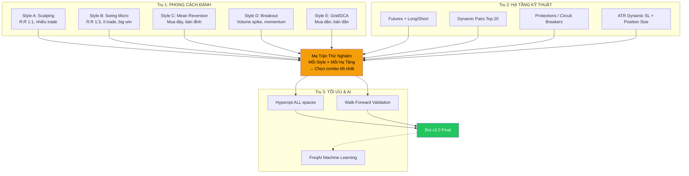

# Kế Hoạch Nâng Cấp Trading Bot v2.0

## Bối Cảnh

**Session 1 kết quả:** +$2.98 / 500 ngày = gần như vô nghĩa
**Nguyên nhân gốc:** Strategy quá conservative, chỉ 1 hướng (long), ít cơ hội

**Quyết định từ user:**
- Leverage: **x2** (mặc định, chỉnh sau)
- Sàn: **Binance Futures**
- Vốn: **$100 USDT** (dry-run trước, live sau)
- Max drawdown: **$10 (10%)** ← khuyến nghị hợp lý cho vốn nhỏ
- FreqAI: **Để phase sau** (khi rule-based strategies đã stable)

---

## Tổng Quan: 3 Trụ Cột Nâng Cấp



---

## Trụ 1: 5 Phong Cách Đánh (Trading Styles)

Mỗi phong cách sẽ được code thành 1 strategy riêng, backtest riêng, so sánh nhau.

### Style A: Scalping Thuần (Tight R:R)

| Thông số | Giá trị |
|:--|:--|
| **Mục tiêu** | Nhiều trade nhỏ, win rate cao |
| **R:R Ratio** | 1:1 (TP = SL) |
| **Take Profit** | 0.3-0.5% |
| **Stop Loss** | 0.3-0.5% |
| **Duration** | 5-30 phút |
| **Win Rate cần** | > 55% (vì R:R = 1:1) |
| **Indicators** | RSI divergence, VWAP bounce, Order flow |
| **Timeframe** | 1m hoặc 5m |
| **Trades/ngày** | 10-30 |

**Ưu:** Nhiều trade = kết quả thống kê nhanh
**Nhược:** Phí ăn profit, cần win rate > 55%

### Style B: Swing Micro (Asymmetric R:R) ← v5 hiện tại gần giống

| Thông số | Giá trị |
|:--|:--|
| **Mục tiêu** | Ít trade nhưng big winners |
| **R:R Ratio** | 1:3 đến 1:5 (TP = 3-5x SL) |
| **Take Profit** | 2-5% |
| **Stop Loss** | 1-1.5% |
| **Duration** | 1-8 giờ |
| **Win Rate cần** | > 25% (vì winners lớn hơn losers nhiều) |
| **Indicators** | EMA cross + ADX + Multi-TF trend |
| **Timeframe** | 5m entry, 1h confirmation |
| **Trades/ngày** | 1-3 |

**Ưu:** Win rate thấp vẫn profitable, ít bị phí ăn
**Nhược:** Drawdown streak dài (5-10 losses liên tiếp bình thường)

### Style C: Mean Reversion (Mua Đáy Bán Đỉnh)

| Thông số | Giá trị |
|:--|:--|
| **Mục tiêu** | Mua khi quá bán, bán khi quá mua |
| **R:R Ratio** | 1:1.5 |
| **Take Profit** | BB middle band |
| **Stop Loss** | BB outer + buffer |
| **Duration** | 30 phút - 4 giờ |
| **Win Rate cần** | > 45% |
| **Indicators** | BB bands + RSI extreme + Stoch RSI |
| **Timeframe** | 5m hoặc 15m |
| **Conditions** | CHỈ khi ADX < 20 (sideway market) |
| **Trades/ngày** | 3-10 |

**Ưu:** Trade được cả khi thị trường sideway
**Nhược:** Bị nghiền nát khi trend mạnh (mean doesn't revert)

### Style D: Breakout (Đánh Phá Vỡ)

| Thông số | Giá trị |
|:--|:--|
| **Mục tiêu** | Bắt momentum khi giá breakout range |
| **R:R Ratio** | 1:2 đến 1:4 |
| **Take Profit** | ATR × 3 |
| **Stop Loss** | ATR × 1 |
| **Duration** | 15 phút - 2 giờ |
| **Win Rate cần** | > 35% |
| **Indicators** | BB squeeze (width < threshold) + Volume spike (3x avg) |
| **Timeframe** | 5m |
| **Conditions** | Volume phải > 3x average tại candle breakout |
| **Trades/ngày** | 1-5 |

**Ưu:** Big moves = big profit per trade
**Nhược:** Nhiều false breakout = whipsaw losses

### Style E: Grid/DCA (Mua Dần Bán Dần)

| Thông số | Giá trị |
|:--|:--|
| **Mục tiêu** | Average vào position dần dần |
| **R:R Ratio** | Dynamic (DCA giảm avg entry) |
| **Cơ chế** | Mua thêm khi giá giảm 1%, 2%, 3% |
| **Stop Loss** | Max 3 lần DCA, total loss cap 5% |
| **Indicators** | Support levels + Volume profile |
| **Freqtrade** | `adjust_trade_position()` callback |
| **Trades/ngày** | Continuous |

**Ưu:** Average down = entry price tốt hơn
**Nhược:** Thua to nếu trend down liên tục (catching falling knife)

> [!IMPORTANT]
> **Mỗi style sẽ backtest riêng → so sánh → chọn top 2-3 → chạy song song.**
> Mục tiêu KHÔNG phải tìm 1 style hoàn hảo, mà tìm **combo styles bù trừ nhau** trong các điều kiện thị trường khác nhau.

---

## Trụ 2: Hạ Tầng Kỹ Thuật

### 2.1 Futures + Long/Short (x2)

#### [MODIFY] config.json
```json
{
    "trading_mode": "futures",
    "margin_mode": "isolated",
    "liquidation_buffer": 0.05,
    "dry_run": true,
    "dry_run_wallet": 100,
    "stake_amount": 15,
    "max_open_trades": 3,
    "exchange": {
        "name": "binance",
        "pair_whitelist": ["BTC/USDT:USDT", "ETH/USDT:USDT", "SOL/USDT:USDT"]
    }
}
```

**Tính toán $100 vốn:**
- Stake: $15/trade × x2 leverage = $30 effective exposure
- Max 3 trades = $45 exposure = 45% wallet (chấp nhận được)
- 1 trade thua max: $15 × 1.5% SL × 2x = $0.45
- 3 trades thua cùng lúc: $1.35 = 1.35% wallet ✅

### 2.2 Dynamic Pair Selection

```json
"pairlists": [
    {
        "method": "VolumePairList",
        "number_assets": 20,
        "sort_key": "quoteVolume",
        "refresh_period": 1800
    },
    { "method": "AgeFilter", "min_days_listed": 30 },
    { "method": "PrecisionFilter" },
    { "method": "PriceFilter", "min_price": 0.01 },
    { "method": "SpreadFilter", "max_spread_ratio": 0.005 }
]
```

### 2.3 Protections (Circuit Breakers)

```python
protections = [
    {"method": "CooldownPeriod", "stop_duration_candles": 3},
    {"method": "StoplossGuard", "lookback_period_candles": 24,
     "trade_limit": 3, "stop_duration_candles": 24, "only_per_pair": False},
    {"method": "MaxDrawdown", "lookback_period_candles": 288,
     "trade_limit": 10, "stop_duration_candles": 144,
     "max_allowed_drawdown": 0.10}
]
```

### 2.4 ATR Dynamic Stop-Loss + Position Sizing

```python
use_custom_stoploss = True

def custom_stoploss(self, pair, trade, current_time, current_rate, 
                    current_profit, **kwargs):
    dataframe, _ = self.dp.get_analyzed_dataframe(pair, self.timeframe)
    atr = dataframe.iloc[-1]['atr']
    
    if trade.is_short:
        stop_price = current_rate + (atr * 2)
    else:
        stop_price = current_rate - (atr * 2)
    
    return stoploss_from_absolute(stop_price, current_rate, is_short=trade.is_short)
```

---

## Trụ 3: Tối Ưu & Đánh Giá

### 3.1 Ma Trận Thử Nghiệm

Mỗi experiment sẽ test **1 style × 1 config**:

| # | Style | Timeframe | R:R | SL Type | Pairs | Leverage | Status |
|:--|:--|:--|:--|:--|:--|:--|:--|
| E01 | A: Scalping | 5m | 1:1 | Fixed 0.5% | Static 5 | x1 Spot | ⬜ |
| E02 | A: Scalping | 5m | 1:1 | Fixed 0.5% | Static 5 | x2 Futures | ⬜ |
| E03 | B: Swing | 5m/1h | 1:3 | Fixed 8.8% | Static 5 | x1 Spot | ✅ v5 baseline |
| E04 | B: Swing | 5m/1h | 1:3 | ATR × 2 | Dynamic 20 | x2 Futures | ⬜ |
| E05 | C: MeanRev | 15m | 1:1.5 | BB outer | Static 5 | x1 Spot | ⬜ |
| E06 | C: MeanRev | 15m | 1:1.5 | BB outer | Dynamic 20 | x2 Futures | ⬜ |
| E07 | D: Breakout | 5m | 1:3 | ATR × 1 | Dynamic 20 | x2 Futures | ⬜ |
| E08 | E: DCA | 5m | Dynamic | 5% total | Static 5 | x1 Spot | ⬜ |
| E09 | Combo: B+C | Mixed | Mixed | Mixed | Dynamic 20 | x2 | ⬜ |
| E10 | Combo: B+C+D | Mixed | Mixed | Mixed | Dynamic 20 | x2 | ⬜ |

**Mỗi experiment ghi kết quả:**
- Total P/L, Win%, Trades, Drawdown, Sharpe
- So sánh vs baseline (E03)
- Verdict: ✅ KEEP / ❌ REJECT / ⚠️ REFINE

### 3.2 Walk-Forward Validation (Chống Overfitting)

```
Data split:
├── Train:    2025-01 → 2025-06 (6 tháng) — hyperopt ở đây
├── Validate: 2025-07 → 2025-12 (6 tháng) — test params
└── Test:     2026-01 → 2026-05 (5 tháng) — final check

Quy tắc: Strategy phải profitable trên CẢ 3 giai đoạn mới được duyệt.
```

### 3.3 Scoring System

Mỗi experiment được chấm điểm:

| Metric | Weight | Scoring |
|:--|:--|:--|
| Total Profit | 25% | > 5% = 10đ, > 2% = 7đ, > 0 = 4đ, < 0 = 0đ |
| Max Drawdown | 25% | < 3% = 10đ, < 5% = 7đ, < 10% = 4đ, > 10% = 0đ |
| Sharpe Ratio | 20% | > 1.0 = 10đ, > 0.5 = 7đ, > 0 = 4đ, < 0 = 0đ |
| Win Rate | 15% | > 50% = 10đ, > 40% = 7đ, > 30% = 4đ, < 30% = 2đ |
| Trade Count | 15% | > 200 = 10đ, > 100 = 7đ, > 50 = 4đ, < 50 = 2đ |

**Score > 7.0 → KEEP. Score 5-7 → REFINE. Score < 5 → REJECT.**

---

## Timeline Thực Thi

### Phase 1: Foundation (Ngày 1-2)
- [ ] Chuyển config sang Futures mode ($100, x2, isolated)
- [ ] Download data futures cho 20 pairs
- [ ] Backtest v5 (baseline) trên futures mode
- [ ] Setup walk-forward data split

### Phase 2: Code 5 Styles (Ngày 3-5)
- [ ] Style A: ScalpTight (RSI + VWAP bounce, R:R 1:1)
- [ ] Style B: TrendRider (v5 cải tiến, + short, + ATR SL)
- [ ] Style C: MeanReversion (BB + RSI extreme, ADX < 20 filter)
- [ ] Style D: BreakoutCatcher (BB squeeze + volume spike)
- [ ] Style E: DCAGrid (adjust_trade_position DCA logic)

### Phase 3: Backtest Marathon (Ngày 6-8)
- [ ] Run E01-E10 experiments
- [ ] Score mỗi experiment
- [ ] Chọn top 2-3 strategies
- [ ] Hyperopt top strategies (500 epochs, all spaces)

### Phase 4: Multi-Strategy Setup (Ngày 9-10)
- [ ] Docker Compose multi-instance
- [ ] Config phân bổ vốn giữa strategies
- [ ] Telegram bot notifications

### Phase 5: Dry-Run (2-4 tuần)
- [ ] Chạy top strategies dry-run
- [ ] Daily monitoring + logging
- [ ] Weekly review + adjustment
- [ ] Ghi nhật ký vào STRATEGY_LOG.md

### Phase 6: Live (Sau dry-run OK)
- [ ] Binance Futures API key (Trade + Read only)
- [ ] Start với $100
- [ ] Scale nếu profitable 2 tuần liên tiếp

---

## File Structure Dự Kiến

```
/Users/hoangkien/Youtube/trade/
├── CLAUDE.md                           ← AI context (cập nhật mỗi session)
├── docker-compose.yml                  ← Multi-strategy setup
├── docs/
│   ├── STRATEGY_LOG.md                 ← Nhật ký + kết quả tất cả experiments
│   ├── DECISIONS.md                    ← Chọn/loại bỏ + lý do
│   ├── SETUP.md                        ← Hướng dẫn
│   ├── UPGRADE_PLAN.md                 ← FILE NÀY
│   └── EXPERIMENT_MATRIX.md            ← Ma trận E01-E10 + scores
└── user_data/
    ├── config-futures.json             ← Config futures (chung)
    ├── config-trend.json               ← Config riêng cho TrendRider
    ├── config-reversion.json           ← Config riêng cho MeanReversion
    ├── config-breakout.json            ← Config riêng cho BreakoutCatcher
    ├── strategies/
    │   ├── ScalpTight.py               ← Style A
    │   ├── TrendRider.py               ← Style B (v5 evolved)
    │   ├── MeanReversion.py            ← Style C
    │   ├── BreakoutCatcher.py          ← Style D
    │   └── DCAGrid.py                  ← Style E
    └── data/binance/                   ← Historical data
```

---

## Kỳ Vọng Thực Tế vs Mục Tiêu

> [!WARNING]
> ### Với $100 vốn, kỳ vọng THỰC TẾ:
> | Kịch bản | Monthly Return | Monthly $ | Ghi chú |
> |:--|:--|:--|:--|
> | **Tệ** | -5% đến -10% | -$5 đến -$10 | Bình thường trong 1-3 tháng đầu |
> | **Trung bình** | 0% đến 3% | $0 đến $3 | Đủ bù phí = thành công bước 1 |
> | **Tốt** | 3% đến 10% | $3 đến $10 | Top 20% algo traders |
> | **Xuất sắc** | 10% đến 20% | $10 đến $20 | Top 5% — cần thời gian + iterate |
>
> **Mục tiêu thực tế tháng đầu: KHÔNG THUA > $10.** Profitable = bonus.
>
> $100 là để **học và validate**. Khi đã có strategy profitable → scale lên $500-1000.

## Giải Thích FreqAI (Cho Lần Sau)

**FreqAI** = Freqtrade tích hợp sẵn module AI/ML.

Thay vì bạn code rule:
```python
# Rule-based (hiện tại)
if rsi > 55 and rsi < 60 and adx > 32:
    buy()
```

FreqAI sẽ:
```python
# AI-based (FreqAI)
# Bot tự xem 100+ chỉ số → tự tìm pattern → tự quyết buy/sell/hold
if ai_prediction == "strong_buy":
    buy()
```

**Ưu:** Tự adapt khi thị trường thay đổi, tìm pattern mà con người không thấy
**Nhược:** Black box (khó hiểu tại sao nó buy/sell), cần nhiều data + compute

→ **Kế hoạch:** Implement ở Phase cuối, sau khi rule-based strategies stable.
